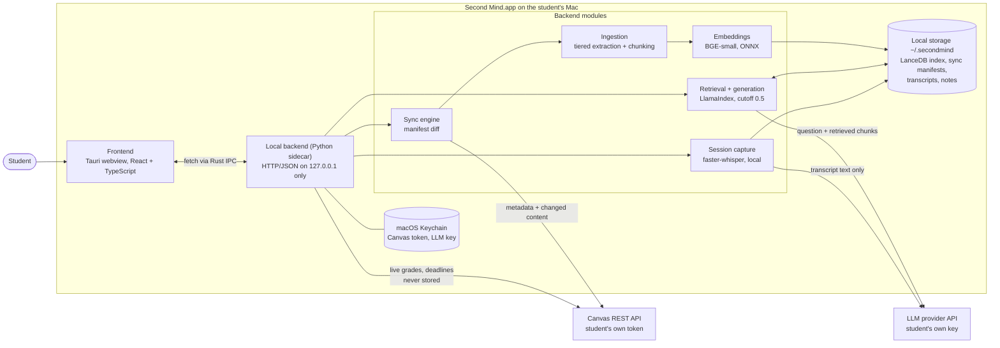

# Second Mind: Technical Design Document

**Sprint 4 deliverable** · Team: Richa, Lakshita, Shatakshi (Product); Arthur, Aaron, Yongje
(Engineering) · Status as of 2026-09-21

This is the consolidated design. Detail lives in the documents linked in §7. Where the code and the
earlier design spec disagree, this document describes the code and says so.

## 1. What we are building

Second Mind is a native macOS desktop app, one install per student, that indexes the student's real Canvas
material and answers questions with citations back to the source. It also transcribes lectures
locally, explains assignments without drafting them, and (planned) generates study artifacts: mock
tests, mindmaps, flashcards, and slides. The app is open source. Three constraints shape every
decision below:

1. **Local-first.** No Second Mind-operated server. Nothing is shared between students.
2. **Grounded or silent.** If the indexed material doesn't support an answer, Second Mind says so instead
   of answering from the model's general knowledge.
3. **Explain, never draft.** Second Mind explains an assignment and points to course material. It never
   produces a submittable answer.

## 2. End-to-end architecture



| Layer | Technology |
| --- | --- |
| User / input | Tauri webview; `getUserMedia`/`MediaRecorder` for lecture audio |
| Interface / output | React + TypeScript (Vite): chat with citations, assignment breakdown, sessions, artifacts |
| Backend / services | Python sidecar, loopback-only HTTP, frozen with PyInstaller |
| Data / storage | LanceDB (hybrid vector + BM25), SQLite manifests, plain files under `~/.secondmind/` |
| AI / processing | BGE-small via `onnxruntime`; LlamaIndex `CitationQueryEngine`; `faster-whisper`; Tesseract OCR |
| External systems | Canvas REST via `httpx`; OpenAI `gpt-4o-mini` today |
| Infrastructure | None operated by us. Ships as a `.dmg` from GitHub Releases |

A local Python sidecar holds the logic because the RAG stack (LlamaIndex, LanceDB, Whisper) is
Python-native, and the process boundary keeps a bad PDF from taking the UI down.

**Core data flows.**

- **A. Sync (Canvas to index).** The student picks courses, then `POST /courses/{id}/sync` lists
  item IDs and `updated_at` values and diffs them against that course's manifest. Only new and
  changed items are fetched. Files go through tiered extraction (plain text, then OCR, then a
  vision fallback for image-heavy pages), are chunked, embedded locally, and written to LanceDB.
  The manifest row is written after the index write, so a crashed sync just retries.
- **B. Question answering.** `POST /courses/{id}/ask` runs hybrid retrieval. A 0.5 similarity
  cutoff (on-topic queries scored 0.66 to 0.75, off-topic 0.31 to 0.40) drops weak nodes. If
  nothing survives, the response is `grounded: false` and **the LLM is never called**. Otherwise
  the question plus retrieved chunks go to the LLM and come back with citations.
- **C. Session capture.** The frontend records audio and uploads it on stop. `faster-whisper`
  transcribes it in the background and the audio is deleted. One LLM pass writes a summary, then
  the transcript and the student's notes are indexed so they are citable in Q&A.

Grades, deadlines, and submission status are fetched live on each request and never stored.

## 3. Technical design and interfaces

### 3.1 Backend HTTP API

All endpoints are on `127.0.0.1`. The frontend never talks to Canvas, the vector store, or an LLM
directly.

| Endpoint | Purpose | Response (abridged) |
| --- | --- | --- |
| `GET /courses` | Live Canvas course list | `{courses: [{id, code, name}]}` |
| `POST /courses/{id}/sync` | Incremental sync, streamed NDJSON | per item, then `{done, new, changed, removed, failed}` |
| `POST /courses/{id}/ask` | Grounded, cited Q&A | `{answer, citations: [{source_type, label, item_id}], grounded}` |
| `POST /courses/{id}/assignments/{aid}/explain` | Assignment breakdown | `{breakdown: [string], pointers: [{label, item_id}]}` |
| `POST /courses/{id}/artifacts/{type}` | *Planned:* mock test, mindmap, flashcards, slides | `{artifact, sources, groundedness}` |
| `POST /courses/{id}/sessions/start`, `POST /sessions/{sid}/stop` | Start a session; upload audio, transcribe async | `{session_id, status}` |
| `GET /courses/{id}/sessions[/{sid}]`, `POST /sessions/{sid}/notes` | List or poll sessions; save notes | `{status, transcript?, summary?, notes?}` |
| `DELETE /courses/{id}/sessions/{sid}` | Delete session files **and** indexed chunks | none |
| `POST /courses/{id}/unselect` | Stop syncing, keep data (reversible) | `{status}` |
| `DELETE /courses/{id}` | Permanently delete index, manifest, recordings | `{status}` |

Two structural choices: `/explain` has **no draft field**, so a future change can't route draft
generation through it by accident, and `unselect` and `DELETE` are separate endpoints because
recordings can't be recovered once deleted. Every error returns `{error: {code, message, detail?}}`
with a meaningful HTTP status (for example `canvas_auth_failed` 401, `llm_rate_limited` 429,
`llm_quota_exceeded` 402, `sync_in_progress` 409), so the UI can branch on the status class.

### 3.2 Data layout

```
~/.secondmind/
├── config.json              non-sensitive settings only
├── index.lancedb/           one table per course
└── courses/<id>/            meta.json, manifest.db, sessions/<date>-class-<N>/ (no audio)
```

Credentials are not in this tree. They live in the macOS Keychain.

### 3.3 Technology choices

| Choice | Why |
| --- | --- |
| Tauri, macOS only for MVP | OS webview keeps the bundle small, no background daemon |
| LlamaIndex + LanceDB | Maintained chunking, retrieval, and citation synthesis; one embedded store with native hybrid search |
| Local ONNX embeddings, not `sentence-transformers` | Bundling torch made the build 1.8 GB against 874 MB |
| Local `faster-whisper` | Recordings never leave the machine; 0.04x real time on CPU |
| Direct Canvas REST, student token | Every request is limited to what the student can already see |
| Student's own LLM key | No Second Mind-operated proxy to secure or pay for |

**Code vs. spec.** The spec says the LLM is pluggable with Claude as the default. The shipped code
calls OpenAI `gpt-4o-mini` directly. The multi-provider layer is planned for Sprint 9.

### 3.4 Deployment

The backend is frozen with PyInstaller and bundled as a Tauri sidecar. Both ML models ship inside
the installer, so there is no first-run download. A tag push in GitHub Actions builds the `.dmg`
and publishes a GitHub Release (v0.1.0 to v0.1.2 exist). The build is ad-hoc signed, not
notarized, so first install needs the right-click, Open Gatekeeper bypass. Notarization needs a
paid Apple Developer account and is scheduled for Sprint 9.

## 4. Reliability

| Failure | Behavior |
| --- | --- |
| LLM down, rate-limited, or out of credit | A specific error in the UI. Never a silent hang or an ungrounded fallback answer |
| Sync crashes partway | Manifest written after the index write, so the item is retried next sync |
| Canvas returns 403/404 for one endpoint | Skip that item or type, log it, continue |
| Vector index corrupted | Rebuilt from Canvas. It is a derived cache |
| Recording or transcript corrupted | **Not recoverable.** No mitigation in the MVP |
| Sidecar crashes | Tauri restarts it. An in-flight question fails visibly and an in-progress recording is lost |

## 5. Security, privacy, and responsible AI

**Security.** Credentials sit in the macOS Keychain, never under `~/.secondmind/`. The backend binds to
loopback only and refuses to write outside the student's data directory. Isolation is physical:
one install per OS user, no shared corpus, so no query filter can leak another student's data.
**Named gap:** no application-level encryption at rest; we rely on FileVault (review in Sprint 8).

**Privacy: what leaves the machine.** The Canvas token goes only to Canvas and the LLM key only to
the LLM provider. Questions, assignment prompts, and the retrieved course chunks go to the LLM
provider on each `/ask` and `/explain`. Page images go there only if the opt-in vision fallback
runs. **Audio never leaves the machine** and is deleted after transcription. Embeddings are computed
locally. One caveat: **lecture transcript text is sent to the LLM provider** once per session for
the summary, under that provider's data terms. That is weaker than the spec's "your recording, your
machine, nobody else's," so it is an open Sprint 8 item (owner: Richa): disclose at onboarding,
make the summary opt-in, or support a local model.

**Responsible AI.**

| Risk | Control |
| --- | --- |
| Hallucinated answers | Below the 0.5 cutoff the LLM is not called at all. Every claim carries a citation (structural) |
| Blending in web knowledge | Grounding rule in the system prompt. Any web search would be a separate, labeled path (not built) |
| Second Mind writing the submission | `/explain` has no draft field, no "draft" action exists, and the prompt says explain and cite only |
| Pointers leaking implementation help | Pointers must stay at topic level. **The post-hoc output check is designed but not built** (Sprint 8) |
| Hallucinated study artifacts | Per-item citations plus a "n / n sources verified" metric (planned, Step 11) |
| Cited source doesn't support the claim | **Not yet designed.** Retrieval relevance is checked, answer faithfulness is not (Sprint 8) |

## 6. Implementation and integration plan

### 6.1 Ownership

Step numbers refer to [implementation-plan.md](implementation-plan.md).

| Owner | Components |
| --- | --- |
| Arthur | App shell and sidecar (0 to 1); credentials and Canvas (2 to 3); error handling and course management (13); packaging and release (14) |
| Aaron | Embeddings, ingestion, chunking, indexing (4 to 6); sync engine (7); cited Q&A backend (8) |
| Yongje | Q&A frontend (9); assignment explainer (10); **study artifacts (11)**; session capture (12) |
| Richa (Product) | Responsible-AI boundaries: validates steps 8, 10, 12 against the explain-never-draft, private-recordings, and grounding rules |
| Lakshita (Product) | Testing rigor: cutoff calibration, regression fixtures, verify against real data |
| Shatakshi (Product) | Docs accuracy, README/CONTRIBUTING, later user and impact validation |

### 6.2 Dependencies and integration points

Build order: `0 → 1 → 2 → 3`, `4 → 5 → 6 → 7 → integration check → 8 → 9 → 10`, with `11`, `12`,
and `13` branching off `8` (and `3`) and all joining at `14` (release). The riskiest integration
points:

1. **Canvas to ingestion (3 to 5).** Student-token gaps mean each content type must be tested
   against a real course before it is trusted.
2. **Frozen sidecar and webview (1).** The webview's native `fetch()` can't reach the loopback
   sidecar, so calls go through `tauri-plugin-http` via Rust IPC (found and fixed in Step 1).
3. **Retrieval to generation (6 to 8).** The 0.5 cutoff is only valid while the embedding model
   and index stay fixed. Changing either means recalibrating.
4. **Session capture to index (12 to 6).** Transcript nodes need timestamps for citations like
   "Lecture 6 · 14:22".

### 6.3 Milestones

Steps 0 to 10, 12, and 13 are implemented, each tested against real data. Step 11 is not started.
Step 14 is half done: the unsigned pipeline ships, notarization does not.

| Sprint | Due | Milestone | Exit check |
| --- | --- | --- | --- |
| 5 | Sep 29 | Core prototype (Steps 0 to 9, in place). **To do:** evaluation vs. the Sprint 3 baseline; citation-groundedness harness | Groundedness and precision@k vs. baseline |
| 6 | Oct 6 | End-to-end alpha: **study artifacts (Step 11)** with caching and regenerate; session capture and explainer already built | Onboard, sync, ask, explain, record, and generate each artifact type |
| 7 | Oct 20 | User and impact validation with real students | Pilot on 49797 and 18654 |
| 8 | Oct 27 | Responsible AI: pointer output check; faithfulness check design; transcript disclosure; encryption decision | Documented review with evidence |
| 9 | Nov 17 | Beta: notarized build, multi-provider LLM, scheduled session prompt, clean-machine install test | A teammate installs from the signed `.dmg` with no dev tooling |
| Final | Dec 1 | Product, impact, and defense | Demo, evaluation, and this document updated |

### 6.4 Open risks

- **Study artifacts are unbuilt.** Q&A is the pillar that ships even if they slip.
- **Image-heavy PDF ingestion** is the largest technical risk. The 100/400-character thresholds
  came from 217 pages in two courses, and the vision fallback's cost at full-course scale is
  unmeasured.
- **Transcription accuracy** was validated only on clean synthetic speech. Real classroom WER is
  untested.
- **Single-machine storage** means no cross-device access, a deliberate trade-off for consent.

## 7. Appendices

[overview.md](overview.md) (full endpoint contracts, deployment, security) ·
[data-model.md](data-model.md) · [canvas-integration.md](canvas-integration.md) ·
[rag-pipeline.md](rag-pipeline.md) · [implementation-plan.md](implementation-plan.md) ·
[contribution-and-distribution-plan.md](contribution-and-distribution-plan.md) ·
[Design spec](../specs/2026-09-14-second-mind-design.md)
