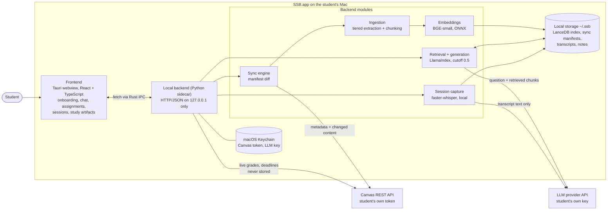

# SSB (Student Second Brain) — Technical Design Document

**Sprint 4 deliverable** · Team: Richa, Lakshita, Shatakshi (Product); Arthur, Aaron, Yongje
(Engineering) · Status as of 2026-09-21

This is the consolidated 4–6 page design. It summarizes the system and links to the detailed
documents in this folder, which serve as appendices (§7). Where the code and the earlier design
spec disagree, this document describes the code and says so.

## 1. What we are building

SSB is a native macOS desktop app, one install per student, that ingests the student's real Canvas
course material and answers questions with citations back to the source. It also transcribes
lectures locally, explains assignments without drafting them, and (planned) generates study
artifacts: mock tests, mindmaps, flashcards, and slides. It is the open-source alternative to
UniFlow Study. The student's index, recordings, and notes stay on the student's machine.

Three constraints shape every design decision below:

1. **Local-first.** There is no SSB-operated server. Nothing is shared between students.
2. **Grounded or silent.** If the indexed material doesn't support an answer, SSB says so instead
   of answering from the model's general knowledge.
3. **Explain, never draft.** SSB explains an assignment and points to course material. It never
   produces a submittable answer.

## 2. End-to-end architecture



**Layers, mapped to the rubric's list:**

| Layer | What it is | Technology |
| --- | --- | --- |
| User / input | Student questions, assignment selection, microphone audio, weekly course schedule | Tauri webview; `getUserMedia`/`MediaRecorder` for audio |
| Interface / output | Chat with citations, assignment breakdown, session pages, artifacts | React + TypeScript via Vite |
| Backend / services | HTTP API, sync, ingestion, retrieval, generation, session capture | Python sidecar, loopback-only HTTP, frozen with PyInstaller |
| Data / storage | Per-course vector tables, sync manifests, transcripts, notes | LanceDB (hybrid vector + BM25), SQLite, plain files under `~/.ssb/` |
| AI / processing | Embeddings, cited generation, transcription, OCR and vision fallback for slides | BGE-small via `onnxruntime`; LlamaIndex `CitationQueryEngine`; `faster-whisper`; Tesseract |
| External systems | Canvas, an LLM provider | Canvas REST via `httpx`; OpenAI `gpt-4o-mini` today |
| Infrastructure | None operated by us. The app ships as a `.dmg` from GitHub Releases | Tauri bundle, GitHub Actions release pipeline |

**Why a local Python sidecar instead of logic in the UI.** The RAG stack (LlamaIndex, LanceDB,
Whisper) is Python-native. A process boundary also keeps a Python crash, such as a bad PDF, from
taking the UI down. Tauri starts and stops the sidecar, so the student sees one app.

### Three core data flows

**A. Onboarding and sync (Canvas → index).**
1. The student pastes a Canvas token and an LLM key. Each is validated with a real call, then
   stored in the Keychain.
2. `GET /courses` lists the student's courses, and the student picks which to index.
3. `POST /courses/{id}/sync` fetches a metadata listing (ID + `updated_at`) for pages,
   assignments, announcements, and the module/file tree. It diffs the listing against that
   course's `manifest.db` into new, changed, deleted, and unchanged items.
4. Only new and changed items are fetched. Files (`.pdf`, `.pptx`) go through tiered extraction:
   plain text first; pages flagged as image-heavy (under 100 characters, or under 400 with an
   embedded image) go to OCR, with a vision-model fallback.
5. Text is chunked (one page or slide per node, with sentence splitting for long prose), embedded
   locally, and written to LanceDB. The manifest row is written only after the index write
   succeeds, so a crashed sync just retries the unfinished item. Raw files are discarded after
   extraction.

**B. Question answering.**
1. `POST /courses/{id}/ask` runs a hybrid retrieval (vector + BM25) over that course's table.
2. A similarity cutoff (0.5, calibrated on real data: on-topic queries scored 0.66–0.75,
   off-topic 0.31–0.40) drops weak nodes. If nothing survives, the response is `grounded: false`
   and **the LLM is never called**.
3. Otherwise `CitationQueryEngine` sends the question plus the retrieved chunks to the LLM and
   returns an answer with citations (`page`, `file`, `transcript`, or `notes`).

**C. Session capture.**
1. The student starts a session. The frontend records audio and uploads it on stop.
2. `faster-whisper` transcribes in a background thread. The audio is deleted as soon as the
   transcript is saved.
3. The transcript goes through one LLM pass to produce a summary. The transcript and the student's
   own notes are then embedded and indexed, so they are citable in Q&A.

Personal academic data (grades, deadlines, submission status) is a fourth, separate path. It is
fetched live with the student's token on each request and is never written to disk or indexed.

## 3. Technical design and interfaces

### 3.1 Backend HTTP API

All endpoints are on `127.0.0.1`, JSON unless noted. The frontend never talks to Canvas, the
vector store, or an LLM directly.

| Endpoint | Purpose | Response (abridged) |
| --- | --- | --- |
| `GET /courses` | Live Canvas course list for the picker | `{courses: [{id, code, name}]}` |
| `POST /courses/{id}/sync` | Incremental sync, streamed as NDJSON | one line per item, then `{done, new, changed, removed, failed}` |
| `POST /courses/{id}/ask` | Grounded, cited Q&A | `{answer, citations: [{source_type, label, item_id}], grounded}` |
| `POST /courses/{id}/assignments/{aid}/explain` | Assignment breakdown | `{breakdown: [string], pointers: [{label, item_id}]}` |
| `POST /courses/{id}/artifacts/{type}` | *Planned:* mock test, mindmap, flashcards, slides | `{artifact, sources, groundedness}` |
| `POST /courses/{id}/sessions/start` | Allocate a session directory | `{session_id, status}` |
| `POST /sessions/{sid}/stop` | Upload audio (`audio/mp4`); transcription runs async | `{session_id, status: "processing"}` |
| `GET /courses/{id}/sessions[/{sid}]` | List sessions; poll one for status, transcript, notes | `{status, transcript?, summary?, notes?}` |
| `POST /sessions/{sid}/notes` | Save the student's own notes | — |
| `DELETE /courses/{id}/sessions/{sid}` | Delete session files **and** indexed chunks | — |
| `POST /courses/{id}/unselect` | Stop syncing; keep all data (reversible) | `{status: "unselected"}` |
| `DELETE /courses/{id}` | Permanently delete the course's index, manifest, and recordings | `{status: "deleted"}` |

Two structural decisions are worth naming:
- **No draft field on `/explain`.** The response schema has no place to put a draft, so a future
  change can't route draft generation through this endpoint by accident.
- **`unselect` and `DELETE` are separate endpoints**, not one endpoint with a dangerous flag,
  because recordings can't be recovered once deleted.

**Error contract.** Every endpoint returns `{error: {code, message, detail?}}` with a meaningful
HTTP status, so the UI can branch on the status class first. Examples: `canvas_auth_failed` (401,
prompt to reconnect), `llm_rate_limited` (429, retry), `llm_quota_exceeded` (402, "add credit"),
`model_files_missing` (500, reinstall), `sync_in_progress` (409, disable the action).

### 3.2 Local data layout

```
~/.ssb/
├── config.json              non-sensitive settings only
├── index.lancedb/           one table per course
└── courses/<id>/
    ├── meta.json            code, name, weekly schedule (manual entry is the primary source)
    ├── manifest.db          SQLite sync manifest: item id, type, updated_at, content hash
    └── sessions/<date>-class-<N>/   transcript.json, notes.md, summary.md   (no audio)
```

Credentials are deliberately absent from this tree; they live in the macOS Keychain.

### 3.3 Technology choices

| Choice | Why | What it rules out |
| --- | --- | --- |
| Tauri (macOS only for MVP) | Uses the OS webview, so the bundle stays small and there is no background daemon | Cross-platform builds (future work) |
| LlamaIndex + LanceDB | Maintained chunking, retrieval, and citation synthesis; one embedded store with native hybrid search; one directory per student | A hand-rolled retriever, a server-based vector DB |
| Local ONNX embeddings (BGE-small), not `sentence-transformers` | Bundling torch made the PyInstaller build 1.8 GB against 874 MB without it, and is a known macOS packaging problem | Anthropic-only stacks, since Anthropic has no embeddings API |
| Local `faster-whisper` | Recordings never leave the machine; 0.04× real-time on CPU | Hosted transcription (UniFlow uses Deepgram) |
| Direct Canvas REST via `httpx`, student token | Every request is limited to what the student can already see | Admin-level features (webhooks, calendar) |
| LLM via the student's own key | No SSB-operated proxy to secure or pay for | Free usage for students without a key |

**Where the code differs from the design spec.** The spec says the LLM is pluggable with Claude as
the default. The shipped code uses OpenAI `gpt-4o-mini` directly in `generation.py`, `explain.py`,
and `sessions.py`. The multi-provider layer is planned but not built (milestone in §6). The
`llm_provider` field in `config.json` is written at onboarding but not read.

### 3.4 Deployment

The backend is frozen with PyInstaller (from a hand-written `.spec`) and bundled as a Tauri
sidecar. Both ML models (ONNX embeddings and Whisper) ship inside the installer, so there is no
first-run download and the app works offline apart from Canvas and the LLM call. A tag push in
GitHub Actions builds the sidecar and the `.dmg` and publishes a GitHub Release (v0.1.0 through
v0.1.2 exist). The build is **ad-hoc signed, not notarized**, so a first install needs the
right-click → Open Gatekeeper bypass. Notarization needs a paid Apple Developer account and is
scheduled in §6.

## 4. Reliability

| Failure | Behavior |
| --- | --- |
| LLM provider down, rate-limited, or out of credit | A specific, distinct error in the UI. Never a silent hang, never an ungrounded fallback answer |
| Sync crashes partway | Manifest rows are written after the index write, so the unfinished item is simply retried next sync |
| Canvas returns 403/404 for one endpoint | Skip that item or content type, log it, and continue. Student tokens hit real gaps (for example, the Files listing 403s and files are reached through module items instead) |
| Vector index corrupted or deleted | Rebuilt from Canvas. It is a derived cache |
| Recording or transcript corrupted | **Not recoverable.** These are original data and are the one case with no mitigation in the MVP |
| Sidecar crashes | Tauri restarts it. An in-flight question fails visibly. An in-progress recording is lost |
| Sync is slow on large PDFs | Per-item streamed progress, so the UI shows real progress instead of a spinner |

## 5. Security, privacy, and responsible AI

### 5.1 Security

- **Credentials** are stored in the macOS Keychain, never in `config.json` or anywhere under
  `~/.ssb/`, so a backup tool copying that directory cannot leak them.
- **The backend binds to loopback only.** It is not a network-facing service, but it still
  validates inputs and refuses to write outside the student's data directory.
- **Isolation** is physical: one install per OS user, no shared corpus, so there is no query filter
  whose bug could leak another student's data.
- **Named gap: no application-level encryption at rest.** We rely on FileVault. Reviewed in Sprint 8.

### 5.2 Privacy: what leaves the student's machine

| Data | Destination | When |
| --- | --- | --- |
| Canvas token | Canvas only | Every Canvas request |
| LLM key | The LLM provider only | Every LLM call |
| Question + retrieved course chunks | LLM provider | Each `/ask` that retrieves something relevant |
| Assignment prompt + retrieved chunks | LLM provider | Each "explain this assignment" |
| **Lecture transcript text** | LLM provider | Once per session, to generate the summary |
| Page images | LLM provider | Only if the opt-in vision fallback runs on a page |
| Audio | **Never leaves the machine**, deleted after transcription | — |
| Grades, deadlines, submissions | Fetched live from Canvas, **never stored or indexed** | Per request |
| Embeddings | Computed locally | — |

The last privacy point matters for the consent story. The design spec's claim is "your recording,
your machine, nobody else's." That holds for audio, but transcript text is sent to whichever LLM
provider the student chose, under that provider's data terms. We flag this as an open question for
Sprint 8 (owner: Richa): either disclose it clearly at onboarding, make the summary opt-in, or
support a local model.

### 5.3 Responsible AI

| Risk | Control | Type |
| --- | --- | --- |
| Hallucinated answers | Similarity cutoff (0.5): below it the LLM is not called at all, so it cannot make something up. Every claim carries a citation | Structural |
| Silent blending of web knowledge | Grounding rule in the system prompt. Any web search is a separate, visibly labeled path (not yet built) | Prompt + UI |
| Academic integrity: SSB writing the submission | `/explain` has no draft field. No "draft" action exists anywhere. The system prompt says explain and cite only | Structural + prompt |
| "Where to start" pointers leaking implementation guidance | Tested on a real coding assignment: a pointer tied to a specific task ("this task needs a state flag") is implementation help. Pointers must stay at the topic level. **A post-hoc output check is designed but not built** | Prompt now, check by Sprint 8 |
| Hallucinated study artifacts (worse than none) | Per-item citations, and a separate groundedness metric ("n / n sources verified") | Planned with Step 11 |
| Recording consent | Recordings and transcripts are private to one machine, with no sharing path. Audio is deleted after transcription | Structural |
| Unverified faithfulness (a cited source that doesn't support the claim) | **Not yet designed.** Retrieval relevance is checked, but faithfulness of the answer to its source is not | Open, see §6 |

## 6. Implementation and integration plan

### 6.1 Ownership

| Owner | Components (step numbers refer to `implementation-plan.md`) |
| --- | --- |
| Arthur | App shell and sidecar (0–1); credentials and Canvas integration (2–3); error handling and course management (13); packaging and release pipeline (14) |
| Aaron | Embeddings, ingestion, chunking and indexing (4–6); sync engine (7); the chained integration check; generation and cited Q&A (8) |
| Yongje | Q&A frontend (9); assignment explainer (10); **study artifacts (11)**; session capture (12) |
| Richa (Product) | Responsible-AI boundaries: validates steps 8, 10, and 12 against the explain-never-draft, recordings-private, and grounding rules |
| Lakshita (Product) | Testing and calibration rigor: cutoff calibration, regression fixtures, "verify against real data, not mocks" |
| Shatakshi (Product) | Docs accuracy, README/CONTRIBUTING/issue templates, later user and impact validation |

### 6.2 Dependencies and integration points

```
0 → 1 → 2 → 3 ──────────────┐
      4 → 5 → 6 → 7 ── integration check ── 8 → 9 → 10 ─┐
                                             │            ├→ 14 (release)
                                             ├→ 11 ───────┤
                                             └→ 12 ───────┤
                                          3, 8 → 13 ──────┘
```

The integration points with the highest risk, in order:
1. **Canvas → ingestion** (Steps 3 → 5). Student-token gaps mean each new content type must be
   tested against a real course before it is trusted.
2. **Frozen sidecar ↔ webview** (Step 1). The webview's native `fetch()` cannot reach the loopback
   sidecar, so all calls go through `tauri-plugin-http` via Rust IPC. This was found and fixed in
   Step 1.
3. **Retrieval → generation** (Steps 6 → 8). The grounding cutoff is only valid if the embedding
   model and index stay fixed. Changing either means recalibrating.
4. **Session capture → index** (Step 12 → 6). Transcript nodes need timestamps to produce
   citations like "Lecture 6 · 14:22".
5. **Artifacts → retrieval** (Step 11 → 8). Artifacts reuse the cited-generation path but need
   their own groundedness metric.

### 6.3 Milestones

Status is as of 2026-09-21. Steps 0–10, 12, and 13 are implemented (per `implementation-plan.md`,
each with a test against real data). Step 11 is not started, and Step 14 is half done: the unsigned
release pipeline ships (tags v0.1.0–v0.1.2), notarization does not.

| Sprint | Due | Milestone | Exit check |
| --- | --- | --- | --- |
| 4 | Sep 22 | This design and the plan | Reviewed by the team |
| 5 | Sep 29 | Core prototype: sync, ingestion, hybrid retrieval, grounded cited Q&A (Steps 0–9, in place). **Still to do:** evaluation report against the Sprint 3 baseline; the citation-groundedness harness on a fixed question set | Groundedness rate and precision@k reported vs. baseline |
| 6 | Oct 6 | End-to-end alpha: session capture and assignment explainer (built); **study artifacts (Step 11)** with caching and regenerate; error contract on every endpoint (built) | A student can onboard, sync, ask, explain an assignment, record a session, and generate each artifact type |
| 7 | Oct 20 | User and impact validation with real students; fix what they hit | Pilot on 49797 and 18654; usability and confidence findings |
| 8 | Oct 27 | Robustness and responsible AI: build the pointer output check; design the answer-faithfulness check; resolve the transcript-to-LLM disclosure; decide on encryption at rest; recording-consent review | Documented RAI review with evidence, not assertions |
| 9 | Nov 17 | Beta and independent testing: notarized build (needs Apple Developer account), multi-provider LLM abstraction, scheduled-window session prompt (currently manual start only), clean-machine install test | A teammate installs from the signed `.dmg` with no dev tooling |
| Final | Dec 1 | Product, impact, and defense | Demo, evaluation, and this document updated to match |

### 6.4 Known open items and risks

- **Study artifacts are unbuilt.** Q&A is the pillar that ships even if artifacts slip.
- **Image-heavy PDF ingestion** is the largest unresolved technical risk. The 100/400-character
  thresholds were calibrated on 217 pages from two courses. They need revisiting on more courses,
  and the vision fallback's cost at full-course scale is unmeasured.
- **Transcription accuracy** was validated only on clean synthetic speech. Real classroom WER is
  untested.
- **Single-machine storage** means no cross-device access. This is a deliberate trade-off for the
  consent stance.
- **Missed lectures can't be recovered.** Session capture only starts when the student presses
  record.

## 7. Appendices (detail documents)

| Document | Covers |
| --- | --- |
| [overview.md](overview.md) | Full endpoint contracts, error table, deployment, security, reliability |
| [data-model.md](data-model.md) | On-disk layout, course/schedule representation, manifest schema |
| [canvas-integration.md](canvas-integration.md) | Endpoints, access restrictions found by testing, sync mapped to API calls |
| [rag-pipeline.md](rag-pipeline.md) | Extraction tiers, chunking, embeddings, hybrid retrieval, generation |
| [implementation-plan.md](implementation-plan.md) | The 15 steps with owners, dependencies, tests, and findings |
| [contribution-and-distribution-plan.md](contribution-and-distribution-plan.md) | License, CI, release pipeline |
| [Design spec](../specs/2026-09-14-ssb-design.md) | Product thesis, scope, privacy model, tutor behavior, metrics |
